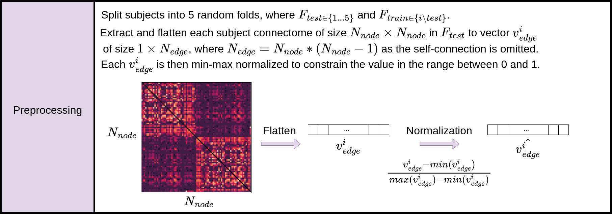
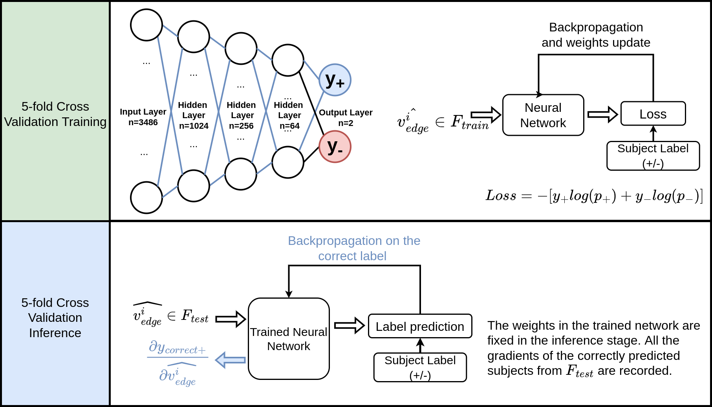

# Connectome Prediction Repository

## Connectome
Connectome is a map of neural connections or pathways in the brain which can be derived from Diffusion-weighted Imaging. It is usually represented as an adjacency matrix where each edge represents the connection strength between two brain regions. The study of connectomes can help us to understand brain function and diseases

## Preprocess
Connectome is an adjacency matrix which is symmetric respect to its diagonal, to avoid data redundancy, only the upper triangle of the connectome matrix is used. The upper traingle was flattened and normalized before fed into the network.

## Cross-validation Training and Inference 
The weights in the trained network are fixed in the inference stage. All the gradients of the correctly predicted subjects from Ftest are recorded.

## Gradient Analysis
Gradient analysis was performed on the correctly predicted edge and node weights. 
